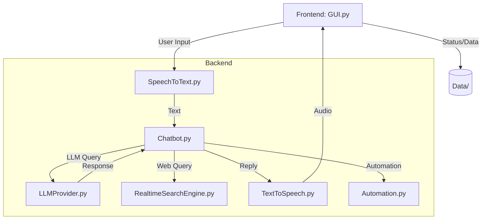

<p align="center">
  
</p>

<h1 align="center">JARVIS – Voice-Assisted AI Desktop</h1>

<p align="center">
  <b>Conversational AI | Speech Recognition | Desktop Automation | LLM-powered Chat</b><br>
  <a href="#"></a>
  <a href="#"></a>
  <a href="#"></a>
</p>

---

> <b>JARVIS</b> is a professional, extensible, and privacy-focused desktop assistant for Windows. It combines advanced speech recognition, text-to-speech, and LLM-powered chat in a modern desktop GUI. Designed for developers, power users, and tinkerers.

---

## 🚀 Features

| Feature                       | Description                                               |
|-------------------------------|-----------------------------------------------------------|
| LLM Chat                      | Conversational AI backed by pluggable LLM providers        |
| Speech-to-Text (STT)          | Accurate voice input with real-time transcription          |
| Text-to-Speech (TTS)          | Natural voice output for responses                        |
| Desktop GUI                   | Modern, responsive interface for Windows                  |
| Real-Time Web Search          | Augment answers with up-to-date web information           |
| Local Data Storage            | All audio and logs remain on your machine                  |
| Clean Environment Setup       | `.env` for secrets, `.gitignore` for privacy              |
| Modular Backend               | Easily extend with new models or automation tools          |
| One-Click Start               | Simple batch/script launch for end users                   |

---

## 📦 Quick Start

**Prerequisites:**
- Windows OS
- Python 3.10+
- Cohere API key (or other supported LLM)

**Installation:**
```sh
# Clone the repository
$ git clone <your-repo-url>
$ cd JARVIS

# Create and activate a virtual environment
$ python -m venv .venv
$ .\.venv\Scripts\Activate.ps1

# Install dependencies
$ pip install -r Requirements.txt

# Configure environment
$ copy .env.example .env
# Edit .env and set CohereAPIKey=YOUR_COHERE_API_KEY
```

**Run JARVIS:**
```sh
$ python run_jarvis.py
# or
$ start_jarvis.bat
```

---

## 🛠️ Configuration
- All secrets in `.env` (never committed)
- Example template: `.env.example`
- Main variable: `CohereAPIKey`

---

## 🏗️ Architecture



**Key Modules:**
- **Backend**: LLMProvider, Chatbot, SpeechToText, TextToSpeech, RealtimeSearchEngine, Automation
- **Frontend**: GUI.py, Graphics assets, UI state files
- **Data**: Local audio, logs, ignored by Git

---

## 📁 Project Structure

```text
JARVIS/
├── Backend/        # Core AI: LLM, STT, TTS, search, automation
├── Frontend/       # Desktop GUI, graphics, UI state
├── Data/           # Audio, logs (local only)
├── .env.example    # Environment template
├── .gitignore      # Excludes secrets, artifacts
├── Requirements.txt
├── run_jarvis.py   # Main entry point
├── main.py         # Bootstrapper
├── USAGE_GUIDE.md  # Extra usage notes
└── start_jarvis.bat
```

---

## 💡 Usage Tips
- **Mic Control:** Toggle via GUI
- **Responses:** Shown and optionally spoken
- **Data:** All outputs local in `Data/`
- **API Keys:** Rotate regularly

---

## 🧩 Extending JARVIS
- Add new LLM providers in `Backend/LLMProvider.py`
- Integrate new tools or automations via `Backend/Automation.py`
- Customize GUI in `Frontend/GUI.py` and `Graphics/`

---

## 🩺 Troubleshooting
- **PowerShell Activation:**
  - `Set-ExecutionPolicy -Scope Process -ExecutionPolicy Bypass`
  - `./.venv/Scripts/Activate.ps1`
- **Dependencies:**
  - `pip install -r Requirements.txt`
- **Audio Issues:**
  - Check device, volume, delete old MP3s in `Data/`

---

## 🤝 Contributing
- See `CONTRIBUTING.md` for coding style and PR guidelines
- Please open issues with reproducible steps and logs

---

## 🔒 Security
- See `SECURITY.md` for vulnerability reporting
- Never commit real credentials

---

## 🗺️ Roadmap
- Model provider abstraction/switching
- Enhanced search & citations
- Cross-platform GUI
- Plugin/automation system

---

## 🙏 Acknowledgements
- Python, Cohere, and the open-source community powering JARVIS